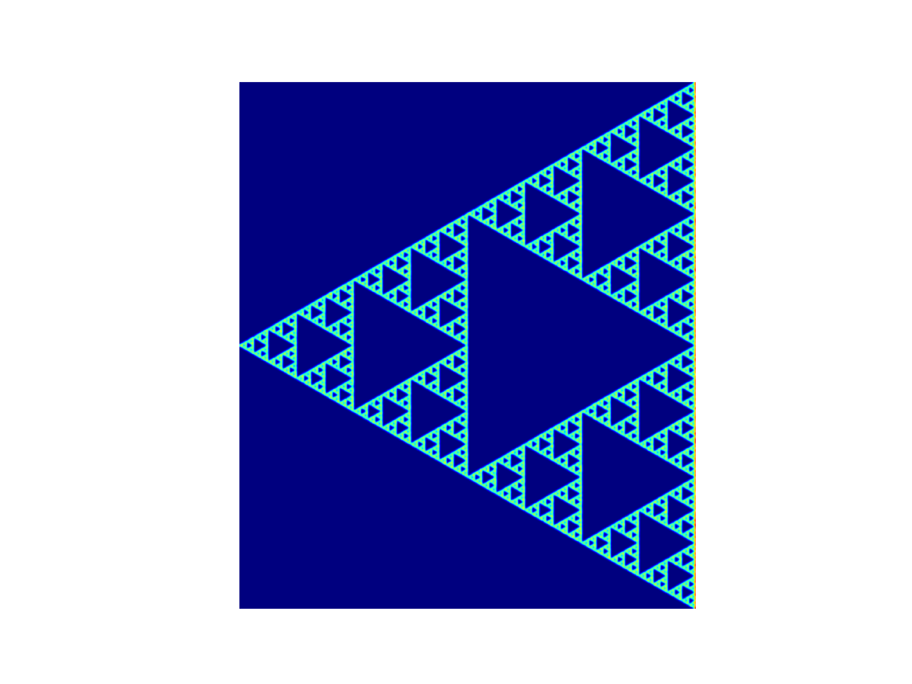

カオスゲームって知ってますか？カオスゲームは多角形内のランダムな点等をシードにするフラクタルの生成方法です。

## メソッド

1. 多角形内にランダムな点を取る。
2. 多角形のランダムな頂点から1.の点までの中心点を取る。
3. 1-2を繰り返す。

このメソッドで最もスタンダードなフラクタルが生成できます。

例えば正三角形をベースに上のメソッドを使うと[シェルピンスキーのギャスケット](https://ja.wikipedia.org/wiki/シェルピンスキーのギャスケット)がフラクタルとして出現します。

## シェルピンスキーのギャスケット

自家製の[カオスゲームフラクタル生成ライブラリ](https://github.com/RW21/fractal-art)で作ったシェルピンスキーのギャスケットです。

```python
cg = ChaosGameRegularPolygon(3)
cg.chaos_game(100000, 0.5)
cg.generate_heatmap(save=True)
```



綺麗ですね(小並感)。

この自己相似的な図形を作る正規のメソッドは:

```
正三角形を用意する。
正三角形の各辺の中点を互いに結んでできた中央の正三角形を切り取る。
残った正三角形に対して2の手順を無限に繰り返す。
```

以上の通りです。

## シェルピンスキーのギャスケットが出現するわけ

最初の点

## 改変カオスゲーム

上記のカオスゲームを少しばかり変えると様々なフラクタルができます。

何を変えるか:
- 最初の多角形
- 中点を取るのではなく、何かの係数を取る
- 多次元への拡張
- ランダムな頂点を選ぶのではなく、選べる頂点を制限する
  - 現在の頂点は次選べない
  - 次の頂点は現在から2つ以上離れてないといけない
  - etc.

### 改変カオスゲームを試す

